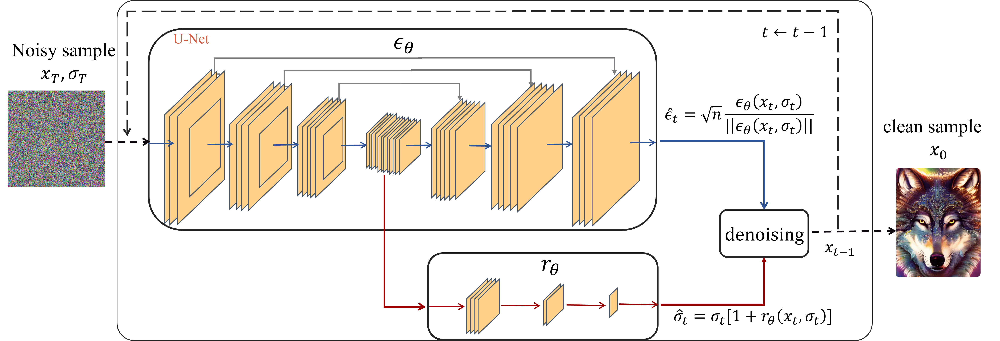

# Enhancing Sample Generation of Diffusion Models using Noise Level Correction

This repository is for Noise Level Correction in Diffusion Models introduced in the following paper:
 
Abulikemu Abuduweili, Chenyang Yuan, Changliu Liu, Frank Permenter, [Enhancing Sample Generation of Diffusion Models using Noise Level Correction](https://arxiv.org/abs/2412.05488), TMLR 2025.   


## Introduction
The denoising process of diffusion models can be interpreted as an approximate projection of noisy samples onto the data manifold. Moreover, the noise level in these samples approximates their distance to the underlying manifold. Building on this insight, we propose a novel method to enhance sample generation by aligning the estimated noise level with the true distance of noisy samples to the manifold. We extend this approach to various image restoration tasks by integrating task-specific constraints, including inpainting, deblurring, super-resolution, colorization, and compressed sensing. Experimental results demonstrate that our method significantly improves sample quality in both unconstrained and constrained generation scenarios. Notably, the proposed noise level correction framework is compatible with existing denoising schedulers (e.g., DDIM), offering additional performance improvements.




## Citation
If you find the code helpful in your research or work, please cite the following papers.
```BibTex
@inproceedings{abuduweili2025enhancing,
  title={Enhancing Sample Generation of Diffusion Models using Noise Level Correction},
  author={Abuduweili, Abulikemu and Yuan, Chenyang and Liu, Changliu and Permenter, Frank},
  booktitle={Transactions on Machine Learning Research},
  year={2025}
}
```


